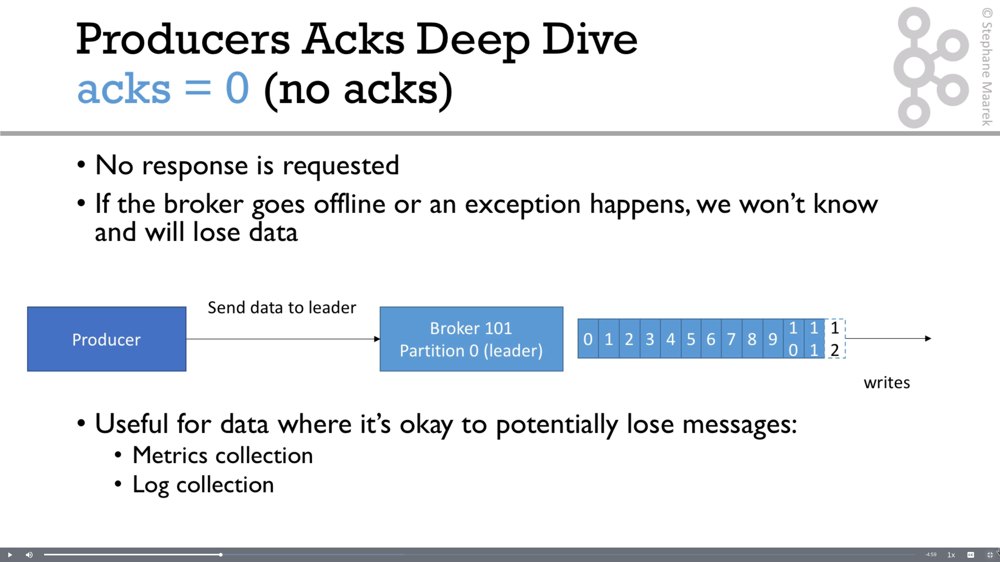
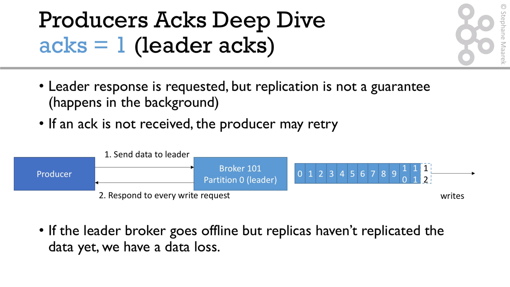
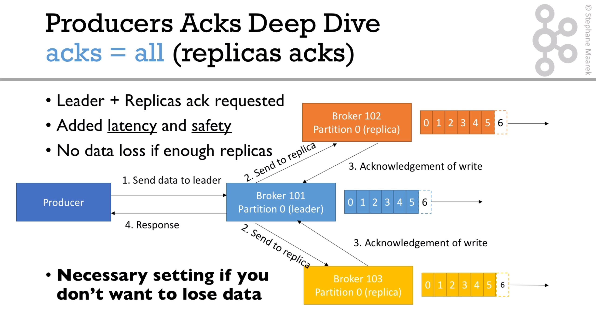
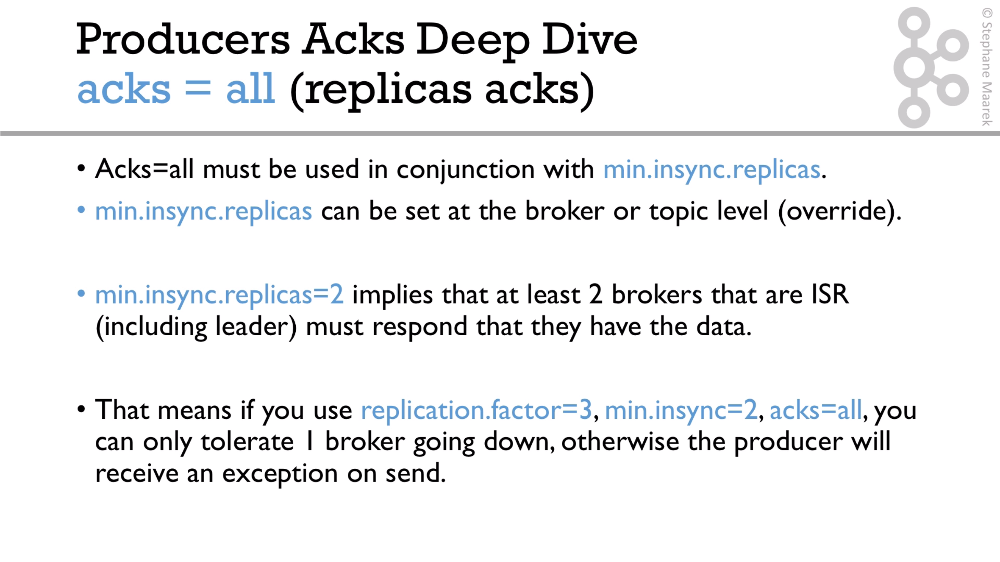
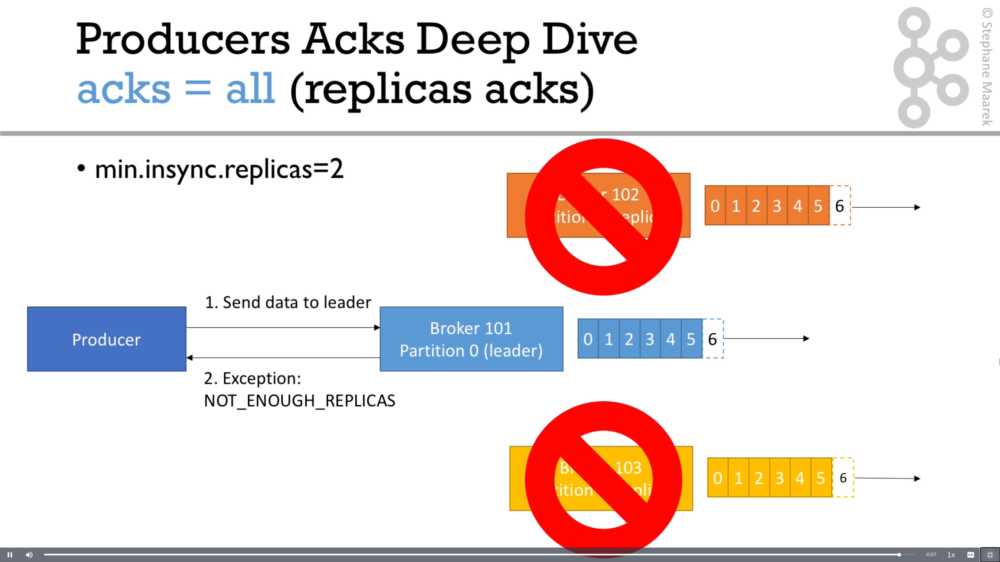

# Producer acknowledgment

We have basically 3 options to configure `acks` Producer property.

### Acks = 0

### Acks = 1

### Acks = all

### Example:
If we use min.insync.replicas=2 and 2 brokers goes down, we have the next situation:

For the video explication follow this [link](https://subscription.packtpub.com/video/application_development/9781789342604/99134/99140/acks-and-min-insync-replicas).

