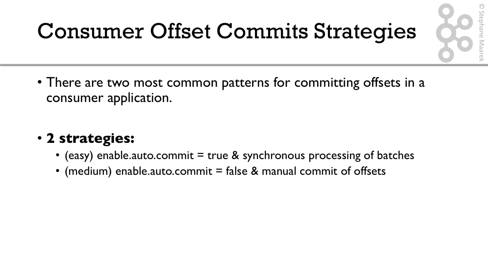
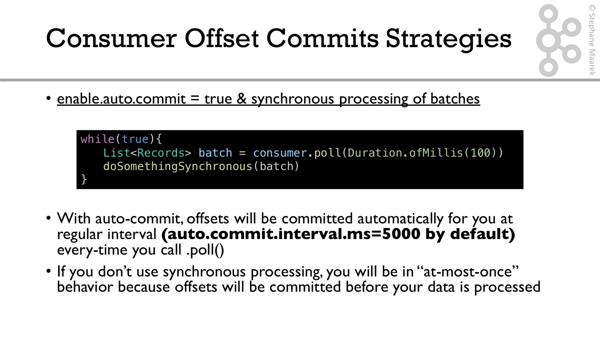
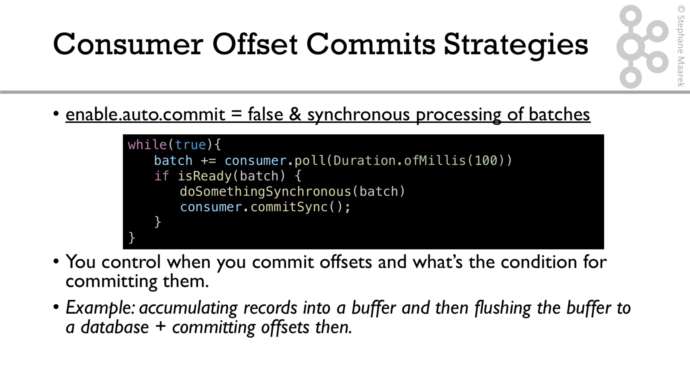
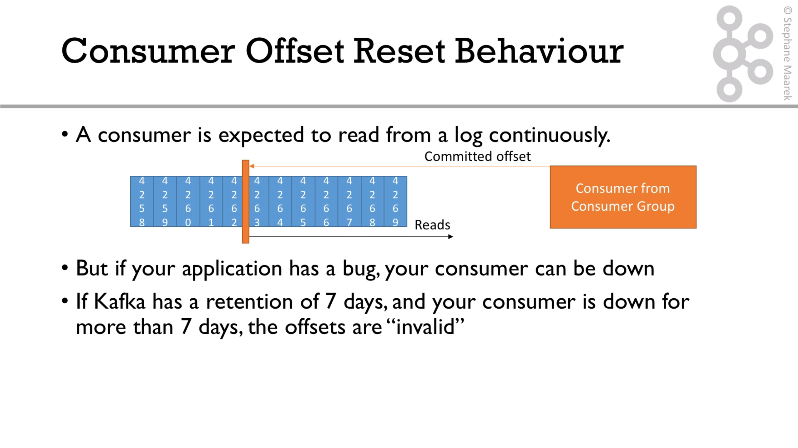
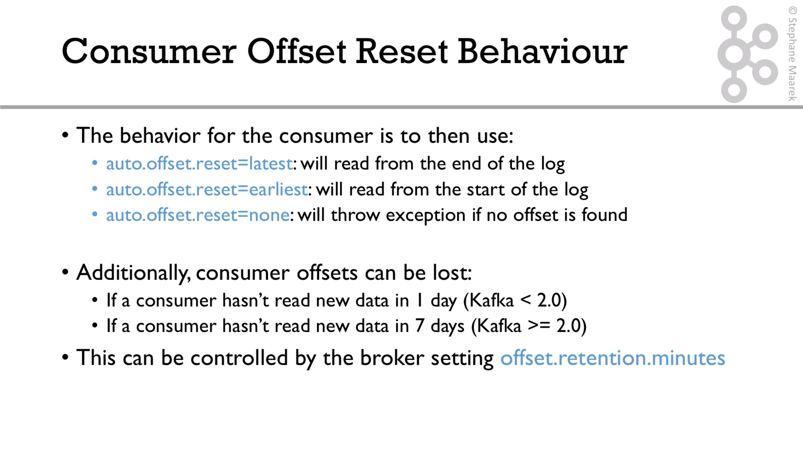
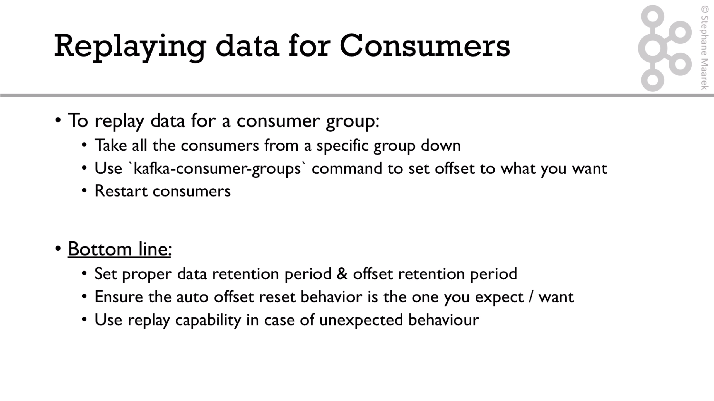

# Commit Offset Strategies








In the consumer we have to set these properties in order to implement the second strategy:

```java
properties.setProperty(ConsumerConfig.ENABLE_AUTO_COMMIT_CONFIG, "false"); // disable auto commit of offsets
properties.setProperty(ConsumerConfig.MAX_POLL_RECORDS_CONFIG, "100"); // disable auto commit of offsets
```

and the loop has to be similarly to this:

```java
        while (true) {
            ConsumerRecords<String, String> records = consumer.poll(Duration.ofMillis(100));

            Integer recordCount = records.count();

            logger.info("Received " + records.count() + " records");

            BulkRequest bulkRequest = new BulkRequest();

            for (ConsumerRecord<String, String> record: records) {
                String id = extractFieldFromJson(record.value(), "id");

                logger.info("Tweet id: " + id);
                IndexRequest request = new IndexRequest("twitter")
                        .id(id) // make it idempotent
                        .source(record.value(), XContentType.JSON)
                        ;

                bulkRequest.add(request);
            }

            if (recordCount > 0 ) {
                BulkResponse bulkResponse = client.bulk(bulkRequest, RequestOptions.DEFAULT);
                logger.info("Committing offsets...");
                consumer.commitSync();
                logger.info("Offsets have been committed");

                try {
                    Thread.sleep(1000);
                } catch (InterruptedException e) {
                    e.printStackTrace();
                }
            }
        }
```

in this case, we have to use bulk to handle this. For more explanation refer to this [video](https://subscription.packtpub.com/video/application_development/9781789342604/99150/99161/consumer-part-5-performance-improvement-using-batching)


# Offset reset






