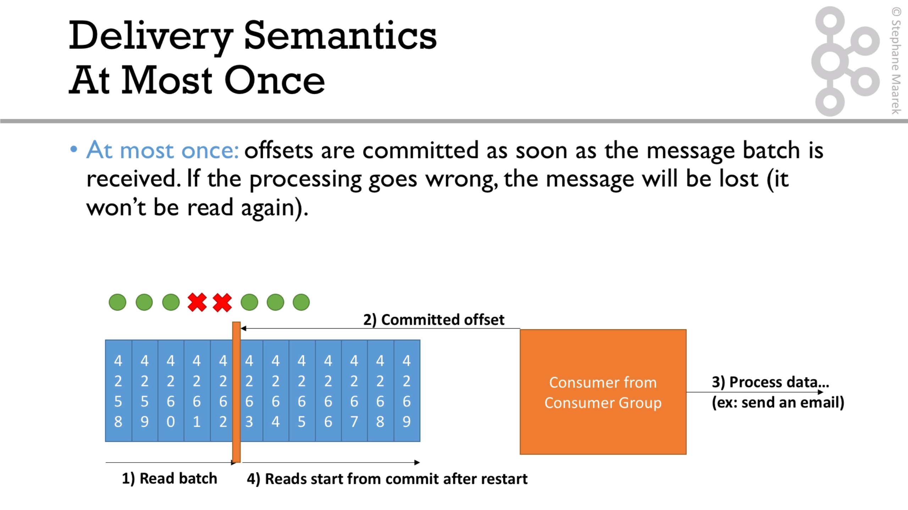
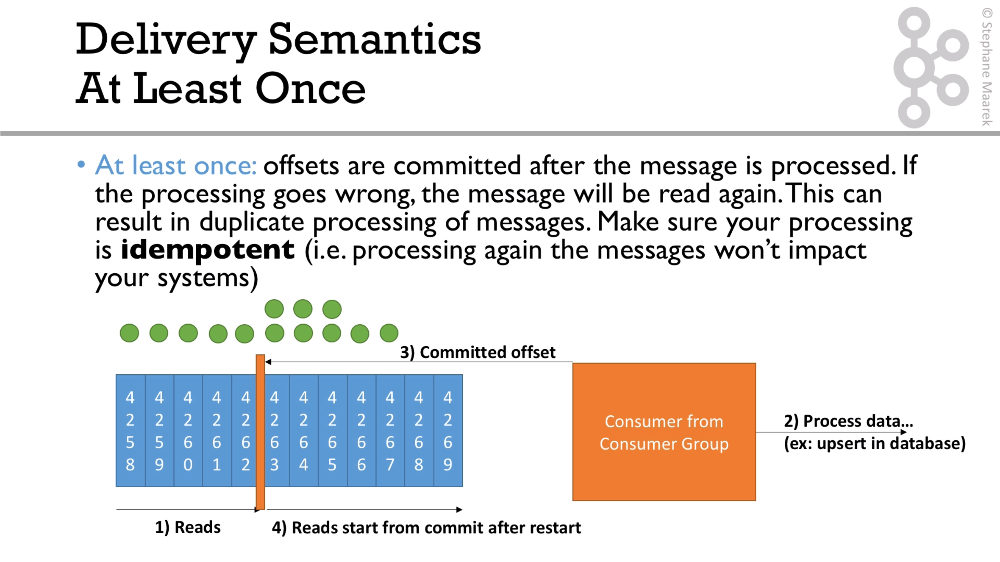
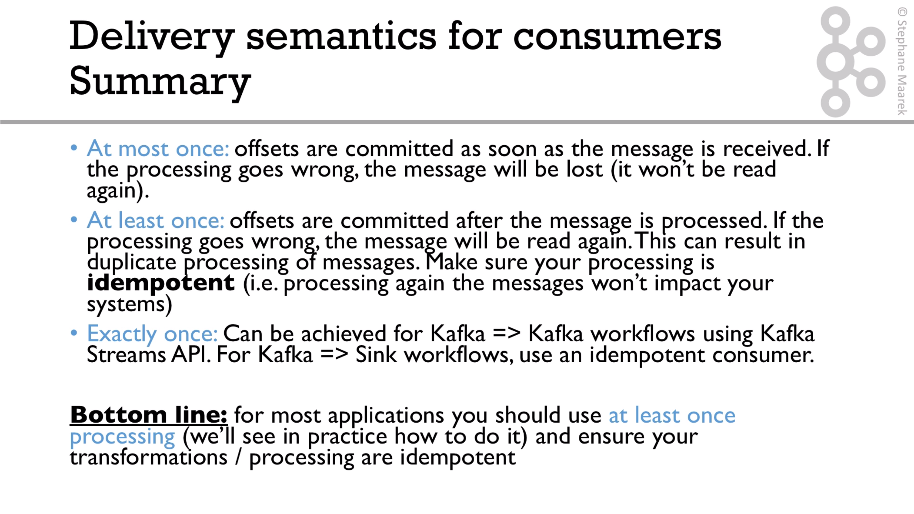

# Consumer semantics

The classification depends on the moment when the messages are commited. The options are: `at most once`, `at least once` and `exactly once`

For explication, see this [video](https://subscription.packtpub.com/video/application_development/9781789342604/99150/99156/delivery-semantics-for-consumers)

By default, the producer is configured with 'autocommit'. 