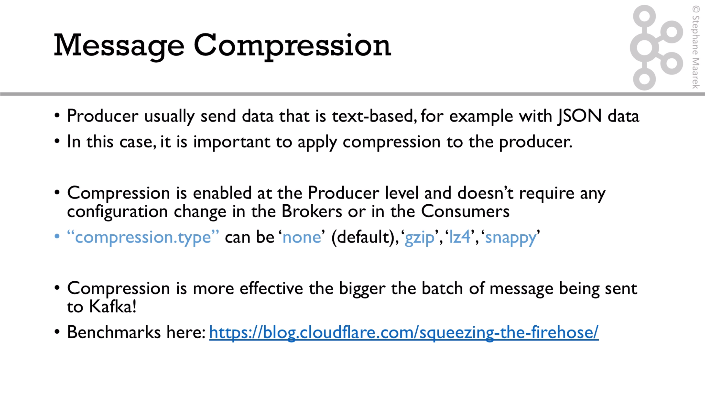
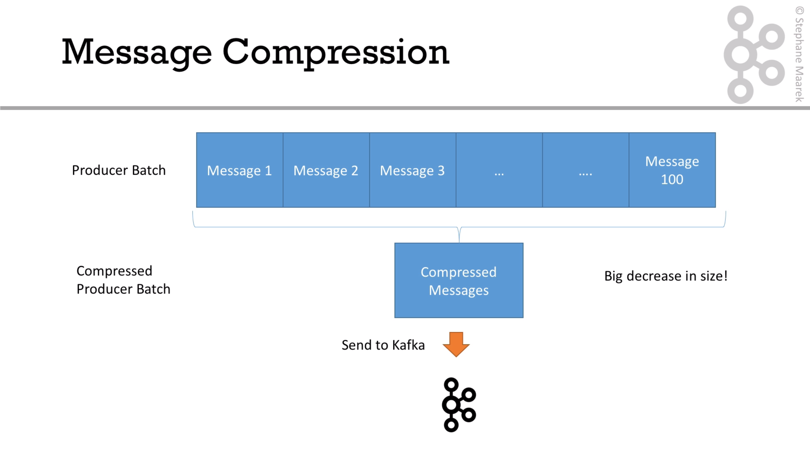
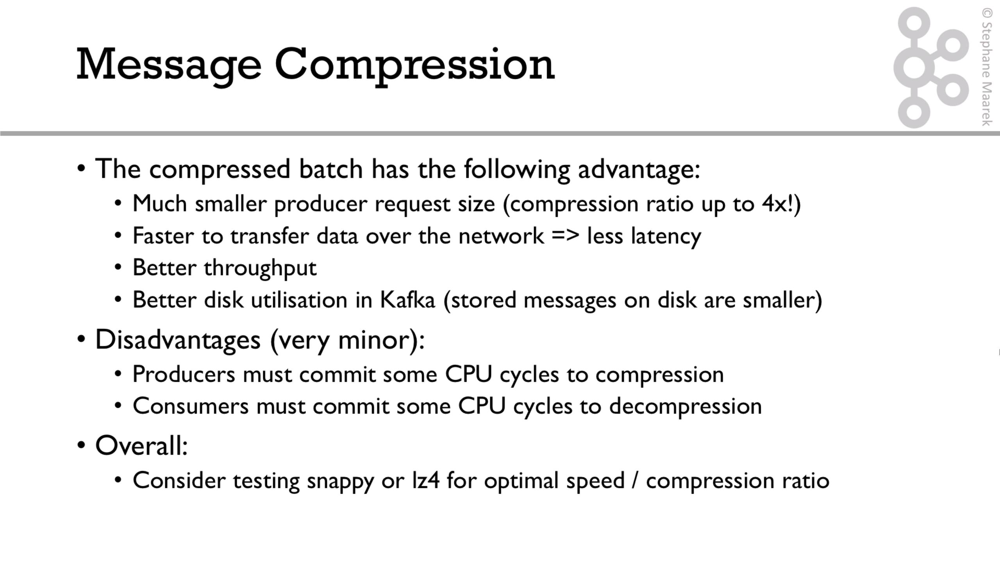
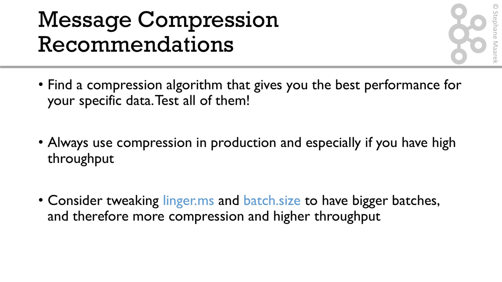

# Producer compression

We can use compression in order to get more throughput and low latency when producing messages to Kafka. 



This is the compression flow:



Compression provide us some advantages:



Recommendations are:




Next, we have a look at the implementation. So we must set these properties in our property class:

```java
properties.setProperty(ProducerConfig.COMPRESSION_TYPE_CONFIG, "snappy");
```


