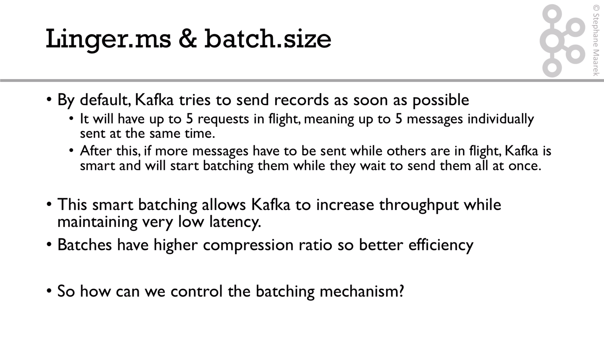
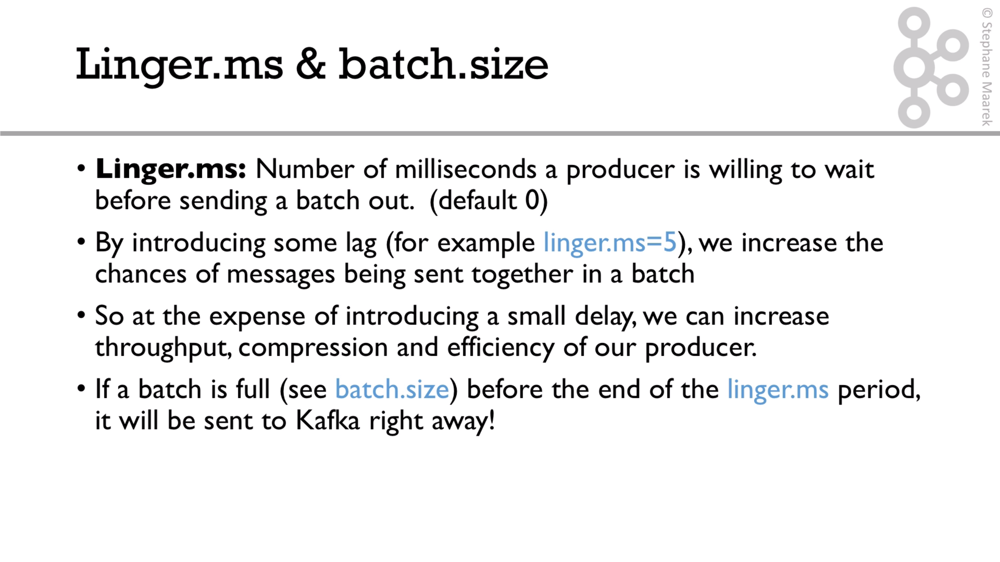
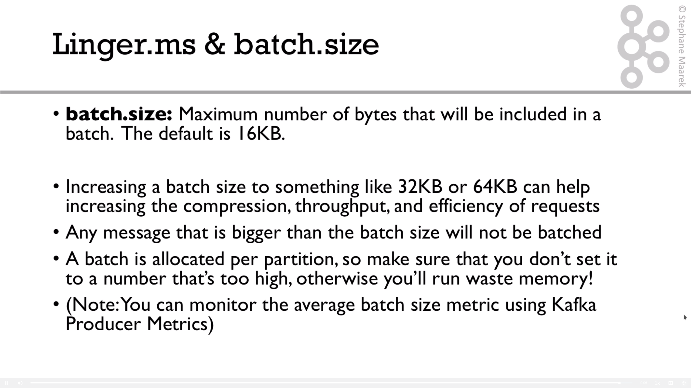
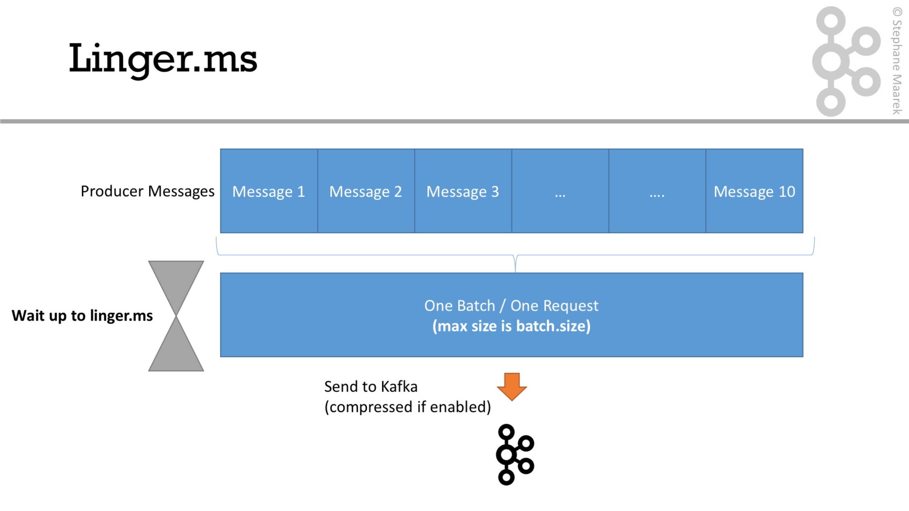

# Linger.ms and batch.size

We can use the `linger.ms` and `batch.size` config to improve throughput. Let's see how is working: 



This is the compression flow:




The following diagram show how it works:



```java
properties.setProperty(ProducerConfig.COMPRESSION_TYPE_CONFIG, "snappy");

properties.setProperty(ProducerConfig.LINGER_MS_CONFIG, "50");
properties.setProperty(ProducerConfig.BATCH_SIZE_CONFIG, Integer.toString(64*1024));
```

In this case, we wait 50ms to get a batch with maximum of size of 64Kb.


