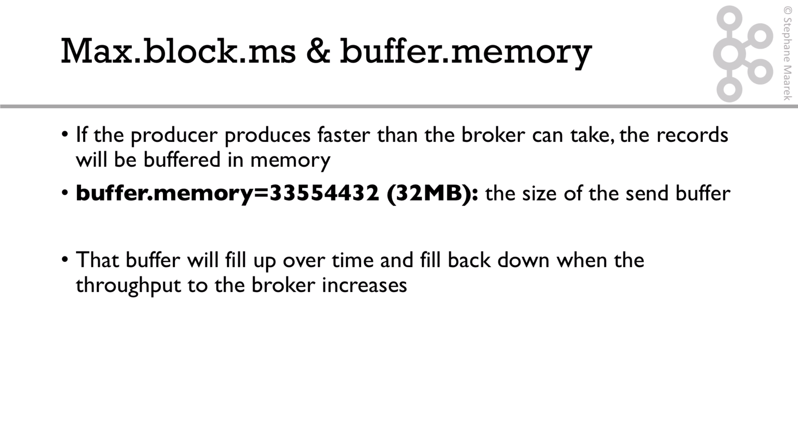
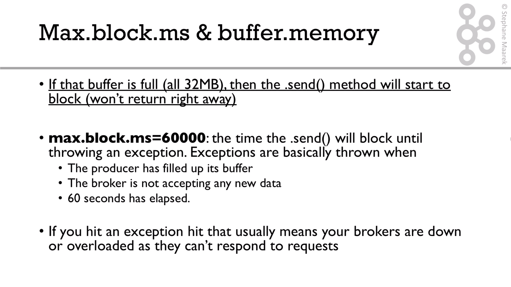

# max.block.ms and buffer.memory

You can also set the producer config property buffer.memory which default 32 MB of memory. 
This denotes the total memory (in bytes) that the producer can use to buffer records to be sent to the broker. 
The Producer blocks up to max.block.ms if buffer.memory is exceeded. 

If the Producer is sending records faster than the broker can receive records, an exception is thrown.

