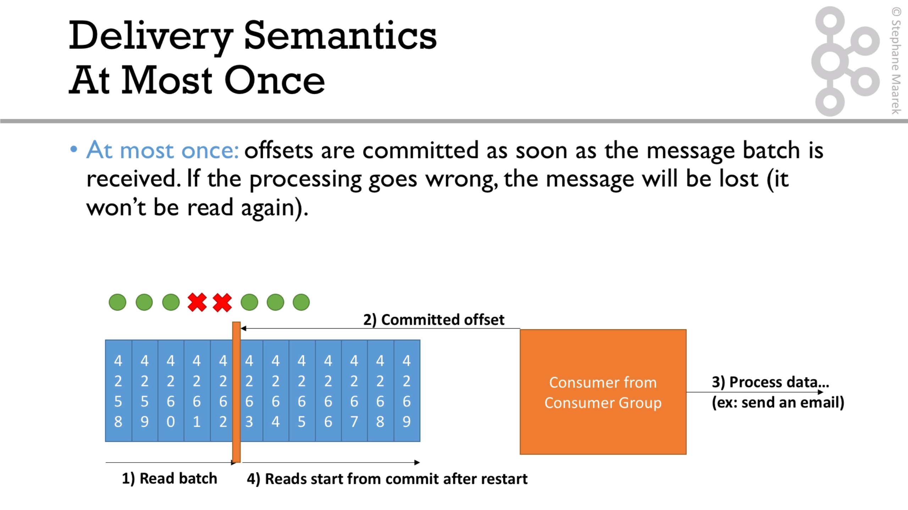
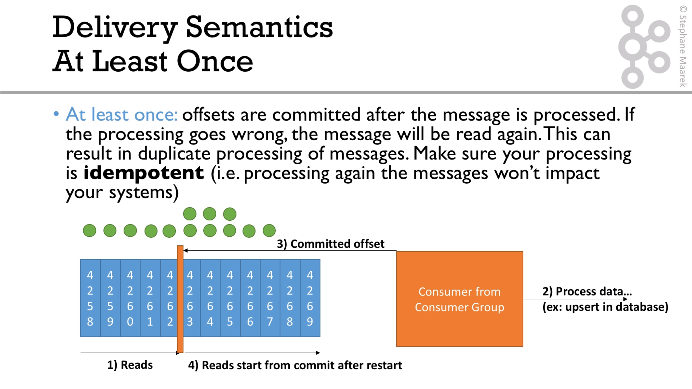
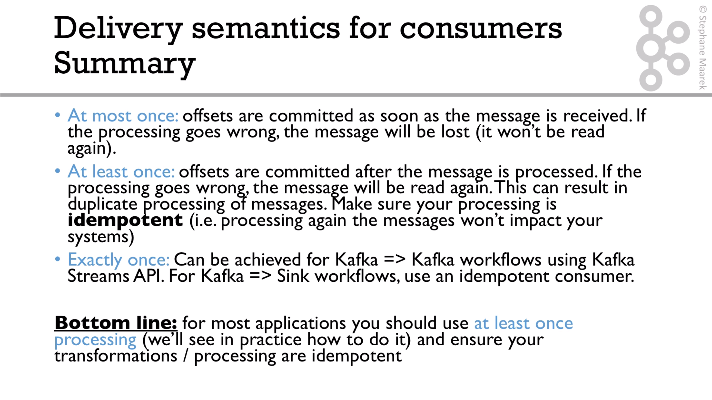

# Consumer semantics

The classification depends on the moment when the messages are commited. The options are: `at most once`, `at least once` and `exactly once`

For explication, see this [video](https://subscription.packtpub.com/video/application_development/9781789342604/99150/99156/delivery-semantics-for-consumers)

By default, the consumer is configured with 'enable.auto.commit'.

The thing is that, make the consumer idempotence if we consume the message twice, the result will be the same.
 
In order to make the consumer idempotent we have 2 strategies, base on how an id is going to be generated:
* Use kafka properties: (topic + partition + id)
* Using specific id from the data (for example, the tweet id field)
