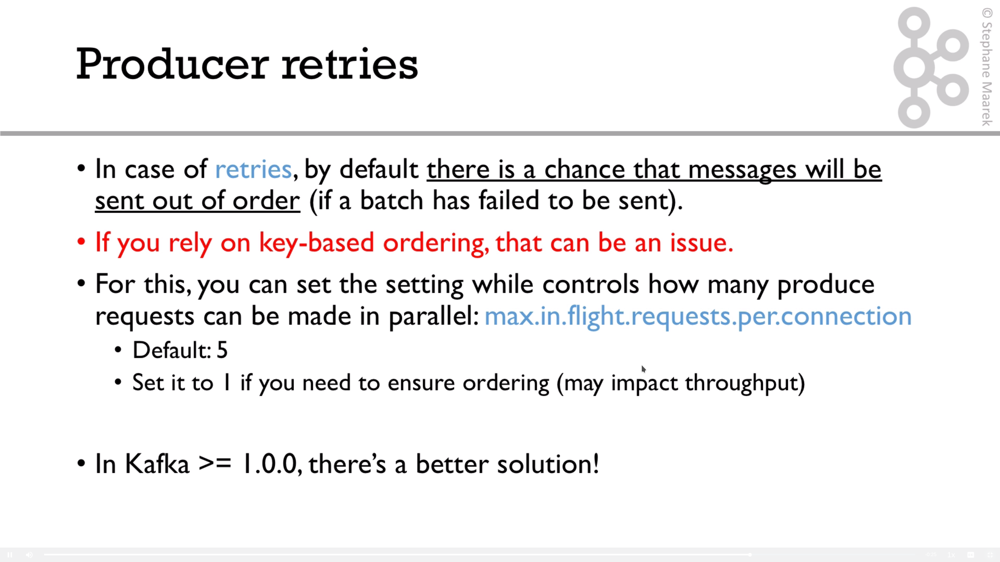
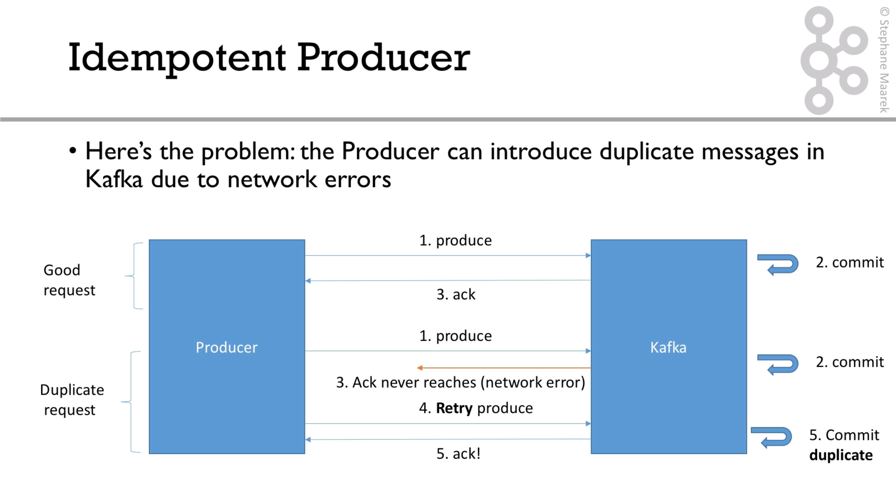
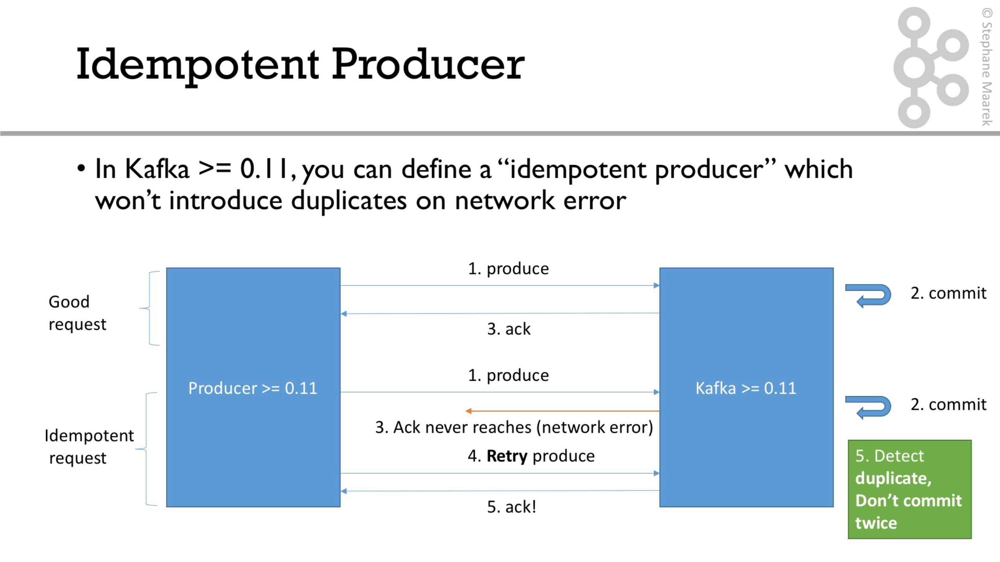
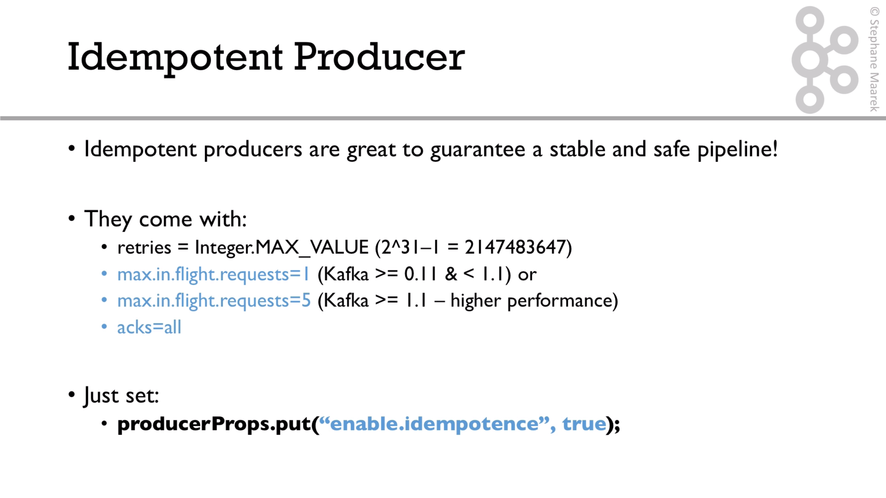
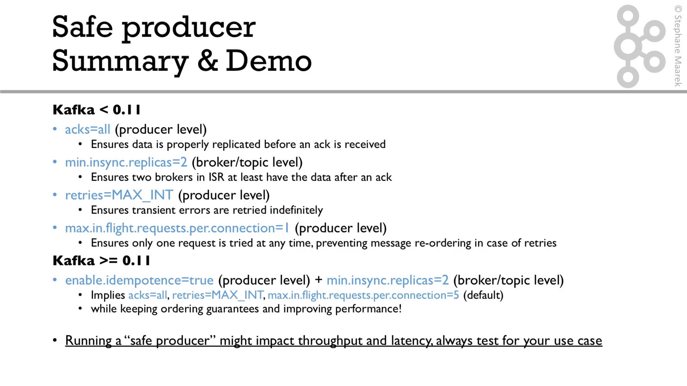

# Producer retries

We can configure how many times the producer is going to retry a failed producer call. 




To solve the ordering problem, we can use the idempotent producer, and here is how it works:



the solution is:



In order to get this behaviour, the config we must tu set is the following:



To summarize:



For the video explication follow this [link](https://subscription.packtpub.com/video/application_development/9781789342604/99134/99141/retries-and-max-in-flight-requests-per-connection).


Next, we have a look at the implementation. So we must set these properties in our property class:

```java
properties.setProperty(ProducerConfig.ENABLE_IDEMPOTENCE_CONFIG, "true");

properties.setProperty(ProducerConfig.ACKS_CONFIG, "all");
properties.setProperty(ProducerConfig.RETRIES_CONFIG, Integer.toString(Integer.MAX_VALUE));
properties.setProperty(ProducerConfig.MAX_IN_FLIGHT_REQUESTS_PER_CONNECTION, "5");
```

Depending on the Kafka version, the first one is equal of the next sentences.


